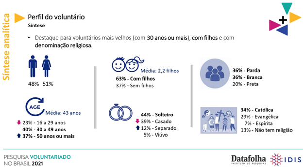

# Introdução

O ano de 2022 iniciou-se com várias tragédias. Nos primeiros 5 meses, 457 pessoas morreram em desastres causados pelo excesso de chuva no Brasil, segundo levantamento da Confederação Nacional de Municípios (CNM), com base nos dados das defesas civis municipais.

Em toda a Bahia, 84 mil vítimas das chuvas ainda estão desabrigadas ou desalojadas. Muitas já voltaram para casa, mas também precisam de ajuda (G1, 2022).

De acordo com Nunes (2013), em situações como esta é imperante a atuação das Autoridades Públicas. Cabem a estas a prevenção e contenção desses desastres. Similarmente, tem-se a atuação do terceiro setor que possui grande força e relevância, principalmente no que diz respeito a prestação de serviços de ajuda humanitária para as vítimas dessas tragédias.

No entanto, para que esses serviços possam ser realizados são necessários voluntários dispostos, organizados e mobilizados. Na Bahia, castigada pelos temporais, fora um desafio encontrar voluntários para distribuir a ajuda recebida. Uma organização social de Salvador conta que já enviou mais de 500 toneladas de donativos. Saíam dois caminhões por dia, mas poderiam ser quatro se houvessem mais voluntários (G1, 2022).

A falta de voluntários em situações urgentes como essa poderia ser atenuada, se os interessados tivessem meios eficazes que os levassem a ter ciência dessas necessidades. Segundo pesquisa do Datafolha, realizada em 2021, 4 de 5 brasileiros consideram o trabalho voluntário importante (opinião de 83% dos entrevistados).

No entanto, a falta de informação sobre essas atividades sociais e de conhecimento acerca das instituições ou ações de ajuda humanitária são uma barreira. Tal problemática é um empecilho para uma adesão maior às mobilizações em projetos sociais não remunerados. Principalmente, naqueles que precisam de ajuda urgente.

Diante deste cenário, torna-se fundamental o desenvolvimento de uma aplicação web de ajuda humanitária, com o intuito de conectar os usuários (voluntários) com atividades e ações urgentes, de forma ativa. Nele, estarão contidas informações a respeito de projetos, organizações e suas relações com a comunidade. Possibilitando um acompanhamento, mapeamento de informações sobre atividades voluntárias disponíveis com agilidade, bem como a possibilidade de se conectar às ONGs atuantes nesta área.

## Problema

Conforme destacado, o problema a ser solucionado se refere a falta de voluntários ou mesmo a falta de mobilização e organização destes durantes períodos de crise e desastres, onde centenas e muitas vezes milhares de pessoas precisam de amparo urgente. A carência de um canal específico de recrutamento e ordenação para causas dessa categoria é um grande obstáculo, pois impossibilita que muitos, dispostos a ajudar, recebam as informações necessárias de imediato ou que saibam como e onde contribuir.

## Objetivos

O objetivo geral deste trabalho é a criação de uma aplicação web de ajuda humanitária, o AMPARE, com o intuito de conectar usuários (voluntários) com atividades, causas e ações sociais urgentes.

Como objetivos específicos, podemos ressaltar:

- Fornecer um acesso intuitivo a causas que precisem de ajuda ativa;
- Conectar organizações sociais e o poder público com voluntários;
- Compartilhar informações, dados e convidar as pessoas para colaborar, com a ajuda humanitária necessária, em situações de crise.

## Justificativa

De cada 5 brasileiros, 4 consideram o trabalho voluntário importante (DATAFOLHA; IDIS, 2022). No entanto, existem muitas barreiras que impedem uma boa parte dessas pessoas de se engajar em ajudas humanitárias. Ainda nessa pesquisa, do Datafolha, 35% dos entrevistados afirmaram que o motivo de não estarem envolvidos nas causas sociais, se dava pelo fato de haver falta de oportunidade, de apoio, de incentivo, de convite ou pela escassez de informação a respeito de como fazer tais serviços.

Para a especialista em gestão de voluntários e voluntariado, Monica Exelrud Vilaarindo, a colaboração dos voluntários em crises emergenciais é fundamental, no entanto não há coordenação na forma como as pessoas são recrutadas e como irão colaborar, podendo provocar tumulto e prejuízo nas ações de assistência. A ex-coordenadora do Programa de Voluntariado da ONU afirma ainda que “Não existe metodologia e rede estruturada de voluntariado para responder a emergências e desastres humanitários, e não existe uma coordenação por parte dos governos locais” (INSTITUTO PARA O DESENVOLVIMENTO DO INVESTIMENTO SOCIAL, 2022).

Por esse motivo, mostrou-se fulcral investir em um meio – aplicação web de ajuda humanitária – para solucionar o problema dessas pessoas, que desejam se voluntariar. Além de, consequentemente, ajudar as causas humanitárias que instituições do terceiro setor e do poder público estão envolvidas.

A criação desta aplicação, com o intuito de dirimir as barreiras encontradas pelo voluntário (usuário) e enfrentadas pelas ONGs, se prova muito útil em situações de grande urgência, onde é necessária uma mobilização ordenada e grande número de pessoas dispostas a ajudar.

## Público-Alvo

Definiu-se como público-alvo os indivíduos brasileiros maiores de idade que desejam participar e colaborar com o bem-estar da sua comunidade em nível local e nacional, voluntariando-se em ações humanitárias e ONGs que atuam na área de ajuda humanitária e necessitem recrutar voluntários para atuar em situações emergenciais.

