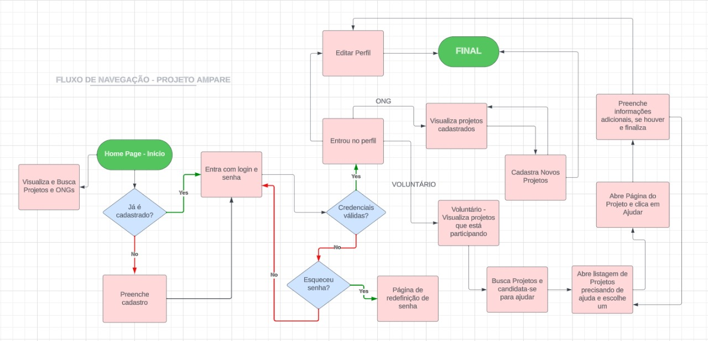

# Projeto de Interface

Pré-requisitos: <a href="2-Especificação do Projeto.md"> Documentação de Especificação</a>

Visão geral da interação do usuário pelas telas do sistema e protótipo interativo das telas com as funcionalidades que fazem parte do sistema (wireframes).</a>.

## Diagrama de Fluxo

Também chamado de Fluxo de navegação, é uma representação na forma de fluxograma que neste caso descreverá a aplicação Web Ampare, com o objetivo de representar a forma como os usuários utilizarão o sistema.

O diagrama apresenta o estudo do fluxo de interação do usuário com a aplicação e muitas vezes sem a necessidade do desenho do design das telas da interface. Isso permite que o design das interações seja bem planejado e gere impacto na qualidade no design do wireframe interativo que será desenvolvido logo em seguida.

## Wireframes

Wireframes são protótipos que podem ter baixa ou alta fidelidade e são usados como esboço para a criação posterior das telas do sistema. Nosso protótipo é de baixa fidelidade no que se refere ao design, porém permite navegação entre as telas e visualização abrangente da aplicação.

O diagrama apresentado abaixo mostra o mapa do site, contendo as várias telas que o sistema deverá possuir para que os diferentes tipos de usuário possam navegar. O wireframe e protótipo foram elaborados utilizado a ferramenta Figma e também poderão ser acessados através do link abaixo.

