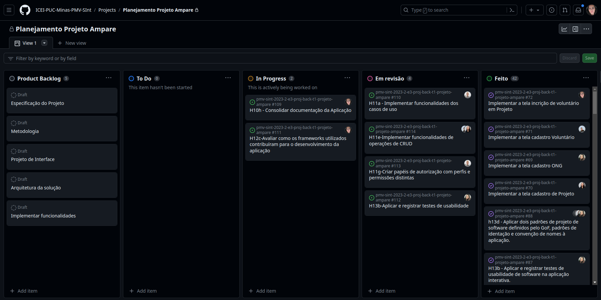

# Considerações Finais

Durante o processo de desenvolvimento do projeto Ampare, foram empregados diversos frameworks e tecnologias essenciais, incluindo o uso do Entity framework core, a implementação do Razor e SQL Server Express, usados na implementação do projeto, bem como tecnologias de apoio durante o processo de planejamento e arquitetura da aplicação. Este conjunto de ferramentas desempenhou papel crucial na construção do sistema, influenciando diretamente sua funcionalidade, desempenho e robustez.

Ao longo deste documento, exploramos a aplicação e integração dessas tecnologias no contexto específico do projeto. Esta seção visa avaliar criticamente a eficácia e o impacto desses elementos, além de oferecer insights sobre possíveis melhorias na arquitetura do projeto e no processo de desenvolvimento como um todo.

O uso de aplicações de apoio durante o processo de planejamento e arquitetura do projeto foi essencial e a utilização do Miro, LucidChart e Figma colaboraram com a criação dos elementos necessários para esta etapa arquitetural, promovendo facilidade e rapidez na utilização. Não foram encontradas dificuldades ou impedimentos para a utilização destas ferramentas.

Para a etapa de implementação do projeto, o Microfundamento estabeleceu como linguagem de programação o ASP.NET C#, usando o Entity Framework Core como ORM e o Razor para criação das interfaces dinâmicas, para backend e banco de dados foi usado o SQL Server Express, o Visual Studio como ambiente de desenvolvimento e o GitHub para controle e versionamento da aplicação e para acompanhamento das sprints.

Na preparação do ambiente de desenvolvimento foi encontrada certa dificuldade por alguns membros da equipe, devido à grande quantidade de espaço em disco demandada pelas aplicações, bem como a alta demanda de processamento da máquina o que deixava os equipamentos lentos. A dificuldade nesta etapa foi uma barreira especialmente difícil para os membros da equipe que usam SO Linux, para estes houve granda demanda de tempo na tentativa de encontrar alternativas para substituir a utilização do Visual Studio pelo VS Code.

A solução encontrada foi diferente para cada um e consistiram na utilização de um ambiente em máquina virtual Windows ou a utilização de extensões do VS code que permitissem a utilização das tecnologias exigidas pelo Microfundamento.
Acreditamos que para turmas futuras seja importante oferecer alternativas, visto que no universo de uma turma existam membros com tipos de equipamentos e sistemas operacionais diferentes, como IDEs que sejam multiplataforma.

A gestão do trabalho do time foi realizada através da metodologia ágil SCRUM utilizando o GitHub para acompanhamento de atividades. O time contou com reuniões semanais que aconteceram tanto na forma de reuniões online, como reuniões assíncronas feitas através de aplicativo de mensagens. As rubricas de cada sprint eram divididas com os membros do time e na sprint seguinte ocorriam atividades de revisão da rubrica iniciada na etapa anterior por outro membro da equipe, isso proporcionou que cada um pudesse se envolver na implementação e revisão de atividades diversas, ampliando o contato de todos entre si e com artefatos diferentes.

A divisão de papeis e tarefas entre os membros do time foi feita da seguinte forma:

- Scrum Master: Com a responsabilidade de facilitar e aprimorar o uso do método SCRUM, temos Maria Michele Freitas assumindo esse papel. Sua função é manter a equipe alinhada e garantir a eficácia do processo é fundamental para nosso progresso contínuo.
- Product Owner: Nicolas Wulk atua como nossa Product Owner, representando os interesses dos stakeholders e garantindo que o projeto atenda às expectativas e necessidades dos usuários finais.
- Equipe de Desenvolvimento: Para a construção do software, contamos com a competência técnica e a colaboração de Angélica Almeida e Raquel Bomjardim. Suas habilidades em trazer conceitos e soluções, são fundamentais para o avanço do projeto.
- Equipe de Design: A criatividade e a estética do projeto são mantidas pela contribuição de Matheus Soares, que traz uma visão única para a interface e a experiência do usuário.

Abaixo seguem a imagem do quadro kanban de atividades dos membros da equipe e imagem do resumo de colaborações de cada membro da equipe de acordo com os commits realizados. Ambas as imagens foram retiradas do repositório do GitHub no dia 3 de Dezembro de 2023.

## Quadro kanban das atividades da Sprint 3

## Quadro de contribuições de acordo com commits

